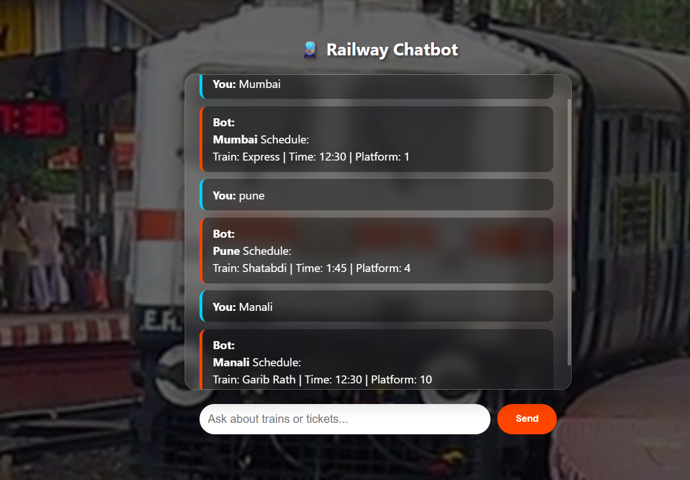

## 🚆 Railway Chatbot

A chatbot that shows Indian Railway train schedules based on station name.

## Features:
- Shows train name
- Shows platform number
- Shows train timing
- Beautiful Vande Bharat background

## How to run:
1. Install Flask: pip install flask
2. Run: python app.py
3. Open browser: 127.0.0.1:5000

## How to use:
- Type any Indian station name
- Example: Mumbai, Pune, Manali, Bangalore
- Bot will show train schedule

## Technologies used:
- Python
- Flask
- HTML, CSS, JavaScript

## Screenshot:

## Made by:
- Pamparani Uttam Dey
- Sneha Sharma
- Utkalika Nayak
